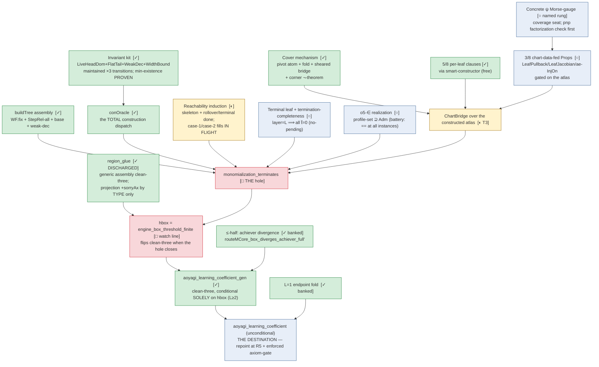

# State of the mathematics — aoyagi-engine (2026-07-18, tick ~136)

One page. Status colors: **[✓] proven clean-three** (kernel-checked, `[propext, Classical.choice,
Quot.sound]`) · **[◐] in flight** (mapped, partially landed) · **[○] pending** (statement settled,
not started) · **[□] the hole** (sorried, statement-locked).

## The theorem tree

## What is already unconditionally true (kernel facts)

- **The analytic half of the box theorem**: `region_glue_of_chartBridge` — given ANY resolution
  tree satisfying ChartBridge, the box integral is finite below half every terminal exponent.
- **The divergence half**: the achiever chart diverges at ½·minAdm (banked, general L).
- **The whole invariant theory of the construction**: four invariants stated and maintained
  through every transition; the chooser's minimum exists on invariant states; the level-ordering
  (STEP1); leaf profiles are admissible (o3).
- **The covering mechanism**: the full pivot family covers (the atom), folds up any tree to
  ChartBridge's image-cover clause, pure and ψ-sheared; a fixed corner chart provably fails.
- **The construction dispatch exists**: `conOracle` is a total Lean function emitting
  guarantee-complete decisions — Aoyagi's §5 procedure as an object.

## The three verified paper defects (ours to repair, all repaired)

1. **Def 3** as printed (broken; the geometric ½·min form used).
2. **p.20 Case-2 label** uses the raw width where its own exponent uses the running-min
   (FIX-A: cap at the running-min; ledgered).
3. **p.15 total-comparability** is FALSE at interior bottlenecks (minimal counterexample
   (2,2,1,1)); repaired by SameLevelChainInv + LiveHeadDom — *invariants the paper never proves,
   now certified and formalized*.

## The remaining distance, in order

1. **Two branch-fills** of the reachability induction (case-2 mechanical; case-1 = the
   mutual-induction coupling via `occ.min?` minimality) — in flight.
2. **Terminal leaf + termination-completeness** (layer=L ⟹ no pending divisors) + **o5-∈**
   (the construction realizes every admissible stratum) → `monomialization_terminates`
   closes **modulo ChartBridge**.
3. **The ψ-track**: pnp's single-ψ factorization fidelity check → the concrete Morse-gauge
   (coverage seat) → the 3 chart-data-fed per-leaf Props → ChartBridge over the real atlas.
4. **Wiring**: the hole fills → `engine_box_threshold_finite` flips clean-three (**the hbox
   event**) → repoint the canonical headline → `aoyagi_learning_coefficient` unconditional,
   with the enforced axiom-gate.

## Reading the risk

Nothing left is uncertified: every remaining Lean step formalizes either a pen-and-paper
certificate with executable witnesses (the fills, termination-completeness, o5-∈) or a
page-pinned chart computation (the ψ-gauge). The one seam watched most closely: the ψ-composed
chart geometry (the factorization check runs before any heavy Lean).
